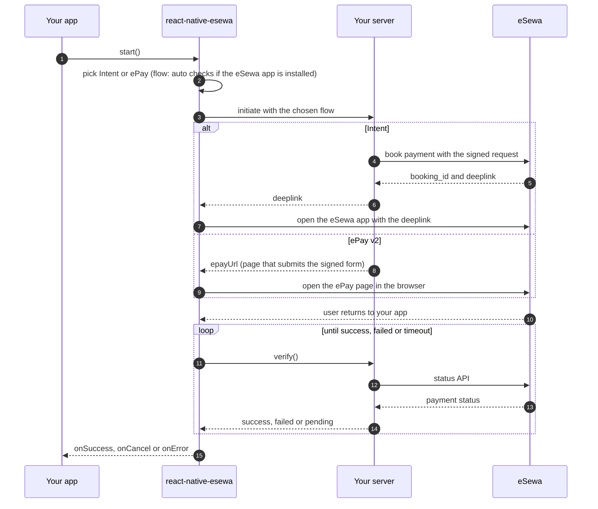
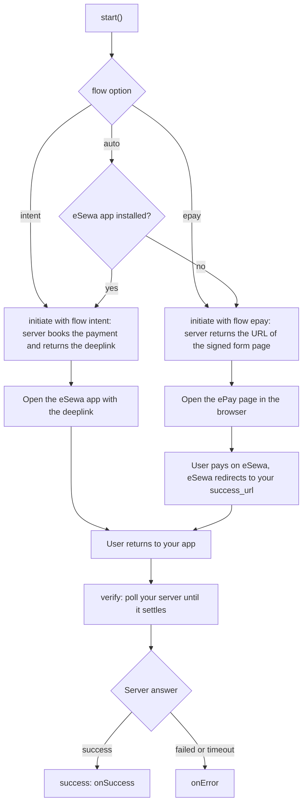
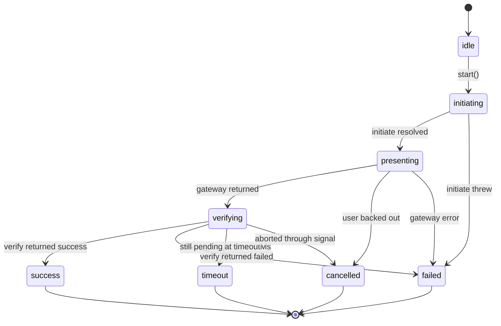

# @klixsoft/react-native-esewa

[](https://www.npmjs.com/package/@klixsoft/react-native-esewa)
[](https://www.npmjs.com/package/@klixsoft/react-native-esewa)
[](https://github.com/klixsoft/react-native-esewa/actions/workflows/ci.yml)
[](LICENSE)
[](#requirements)
[](#api)

Accept [eSewa](https://esewa.com.np) payments in React Native with both current integrations: **Intent** (app to app) and **ePay v2** (hosted page). eSewa publishes no React Native package and its old native SDKs are deprecated, so this library is a small native module for the eSewa app plus a standard `initiate` / `verify` flow.

## Features

- **Intent** flow: jumps straight into the eSewa app and returns; **ePay v2** as the fallback for users without the app
- `flow: 'auto'` picks Intent when the eSewa app is installed, otherwise ePay, and tells your server which to prepare
- One call for the whole payment: `processEsewaPayment({ initiate, verify })`, or the `useEsewaPayment` hook
- Return detection through deep links or app foreground; ePay response parsing helpers
- Typed results and stable error codes
- React Native **New Architecture** (TurboModule + codegen); Android module in Java; nothing proprietary bundled

## Table of contents

- [Requirements](#requirements)
- [Installation](#installation)
- [How it works](#how-it-works)
- [Quick start](#quick-start)
- [Usage](#usage)
- [Server contract](#server-contract)
- [API](#api)
- [Common mistakes](#common-mistakes)
- [Errors](#errors)
- [Security](#security)
- [Documentation](#documentation)
- [Versioning and releases](#versioning-and-releases)
- [Contributing](#contributing)
- [License](#license)

## Requirements

- React Native **0.76+** with the New Architecture enabled
- Android `minSdk` 24, iOS 13+

## Installation

```sh
pnpm add @klixsoft/react-native-esewa
# or: npm install @klixsoft/react-native-esewa   /   yarn add @klixsoft/react-native-esewa
```

### iOS: allow the install check (required)

Add `esewa` to `ios/<App>/Info.plist`, otherwise `isEsewaInstalled()` is always `false` on iOS:

```xml
<key>LSApplicationQueriesSchemes</key>
<array>
  <string>esewa</string>
</array>
```

Then run `cd ios && pod install`.

### Android

Nothing to do: the library manifest declares `<queries><package android:name="com.f1soft.esewa" /></queries>`, which Android 11+ needs to detect the app.

### ePay return deep link (optional)

Register a URL scheme for your app (for example `myapp://`) and point your ePay `success_url` / `failure_url` at it through your server. Without one, the flow detects the user returning by the app coming back to the foreground.

## How it works

Every Klixsoft payment package follows the same three-step lifecycle, so switching gateways does not change how your code is shaped:



> Diagrams are [Mermaid](https://mermaid.js.org). GitHub renders them; on npmjs.com they show as code, so read this README on GitHub for the pictures.

| Step | You provide | The package does |
| --- | --- | --- |
| **initiate** | A function that calls **your server**, which creates the payment with eSewa and returns the Intent `deeplink` or the ePay form URL. | Calls it once, at the start. |
| **present** | Nothing. | Opens the **eSewa app** (Intent) or the hosted **ePay v2** page, then waits for the user to come back. No embedded WebView. |
| **verify** | A function that calls **your server**, which asks eSewa's status API and returns `success`, `failed` or `pending`. | Polls it until the payment settles, times out or is cancelled. |

The result of `present` is never treated as proof of payment. Only `verify` decides the outcome, and it should always be answered by your server from eSewa's own API.

### Do I need `verify`?

Yes. eSewa gives the device no proof of payment: returning from eSewa only means the user came back. Only **your server**, asking eSewa's API, knows whether it was paid, so `verify` is what turns "the user returned" into `success`. It is also what makes the flow resilient: if the app is killed or the network drops, calling `verify` again later gives the right answer.

### Choosing Intent or ePay



`initiate` receives `{ flow }`, so **your server must prepare whichever flow the device chose**. Returning the wrong one is the most common mistake.

### Outcomes and states

While a payment runs, `status` moves through these states, and it always ends in exactly one outcome:



| Outcome | Meaning | Callback | What to show the user |
| --- | --- | --- | --- |
| `success` | Your server confirmed the payment. | `onSuccess` | The receipt or unlocked content. |
| `failed` | The payment failed, `initiate` threw, or the gateway reported an error. `error.code` says which. | `onError` | An error and a "Try again" button. |
| `cancelled` | The user backed out, or you aborted through `signal`. | `onCancel` | Nothing, or a neutral "Payment cancelled". |
| `timeout` | Still `pending` when `timeoutMs` ran out. **The payment may still complete**, so do not tell the user they were not charged. | `onError` (`E_TIMEOUT`) | "We are still confirming your payment", and check the order status later. |

`success` is only ever produced by your server (`verify`), except for Khalti without a `verify` (see below).

## Quick start

```tsx
import { useEsewaPayment } from '@klixsoft/react-native-esewa';

function PayButton({ orderId }: { orderId: string }) {
  const { start, isProcessing } = useEsewaPayment({
    initiate: async ({ flow }) => {
      const order = await api.post(`/orders/${orderId}/esewa`, { flow });
      return { deeplink: order.deeplink, epayUrl: order.epay_url };
    },
    verify: async () => (await api.get(`/orders/${orderId}/status`)).status,
    onSuccess: () => navigation.replace('Receipt'),
    onCancel: () => Toast.show('Payment cancelled'),
    onError: (error) => Toast.show(error instanceof Error ? error.message : 'Payment failed'),
  });

  return <Button title="Pay with eSewa" disabled={isProcessing} onPress={start} />;
}
```

## Usage

### Function

```ts
import { processEsewaPayment } from '@klixsoft/react-native-esewa';

const { outcome, initiation } = await processEsewaPayment({
  flow: 'auto',
  returnPrefix: 'myapp://esewa',
  initiate: async ({ flow }) => {
    const order = await api.post(`/orders/${orderId}/esewa`, { flow });
    return { deeplink: order.deeplink, epayUrl: order.epay_url };
  },
  verify: async () => (await api.get(`/orders/${orderId}/status`)).status,
});
```

`initiate` receives `{ flow }`, the flow the device will use, so your server books an Intent payment or prepares the ePay form accordingly. `initiation.flow` tells you afterwards which one ran.

### Hook

`useEsewaPayment(options)` returns `{ start, cancel, reset, status, isProcessing, error }`. `start()` never throws: failures are put in `error`.

### Choosing the flow

| `flow` | Behaviour |
| --- | --- |
| `'auto'` (default) | Intent if the eSewa app is installed, otherwise ePay. |
| `'intent'` | eSewa app only. Fails with `E_NOT_INSTALLED` if it is missing. |
| `'epay'` | Hosted ePay v2 page only. |

### Callbacks

Instead of reading the result, you can react to the outcome:

```ts
processEsewaPayment({
  initiate,
  verify,
  onSuccess: (initiation) => navigation.replace('Receipt'),
  onCancel: () => showToast('Payment cancelled'),
  onError: (error) => showToast(error instanceof Error ? error.message : 'Payment failed'),
});
```

Each callback is called at most once per payment. `onError` always receives a `PaymentFlowError`: `E_PAYMENT_FAILED` or `E_TIMEOUT` when the server reports a failure or the payment never settles, or a wrapped error (`step` and `cause` set) when a step throws.

### Low level

```ts
import { pay, isEsewaInstalled, openEsewaStore } from '@klixsoft/react-native-esewa';

await pay({ flow: 'intent', intent: { deeplink } });
await pay({ flow: 'epay', epay: { url, returnPrefix: 'myapp://esewa' } });
```

### Options

| Option | Default | Notes |
| --- | --- | --- |
| `initiate` | required | `({ flow }) => Promise<{ deeplink?, epayUrl? }>`. |
| `verify` | required | Returns `'success' \| 'failed' \| 'pending'`. |
| `flow` | `'auto'` | See above. |
| `returnPrefix` | none | Deep link prefix your ePay return URLs use, for example `myapp://esewa`. |
| `openUrl` | system browser | Custom opener for ePay, for example an in-app browser. |
| `intervalMs` / `timeoutMs` | `3000` / `120000` | `verify` polling. |
| `maxVerifyErrors` | `3` | Consecutive `verify` failures tolerated. |
| `onSuccess` | none | Called once, with what `initiate` returned, when the payment succeeded. |
| `onCancel` | none | Called once when the user backed out or stopped waiting. |
| `onError` | none | Called once when the payment failed or timed out (a `PaymentFlowError`) or a step threw. When set, thrown errors no longer reject: the flow resolves `failed` with `result.error`. |
| `signal`, `onStatus` | none | Abort control and step callback. |

### Generic building blocks

The same helpers are exported by all three Klixsoft payment packages, so you can build your own flow on top of them:

| Export | What it is |
| --- | --- |
| `runPaymentFlow(options)` | Runs `initiate`, `present` and `verify` in order and resolves with `{ outcome, initiation }`. |
| `usePaymentFlow(options)` | The same as a React hook: `{ start, cancel, reset, status, isProcessing, error }`. |
| `pollPaymentState(check, options)` | Polls your server until the state is `success` or `failed`; rejects `E_TIMEOUT` / `E_ABORTED`. |
| `PaymentState` | `'success' \| 'failed' \| 'pending'`, what `verify` returns. |
| `PaymentOutcome` | `'success' \| 'failed' \| 'cancelled' \| 'timeout'`, how a flow ended. |
| `PaymentStatus` | `'idle' \| 'initiating' \| 'presenting' \| 'verifying'` or a `PaymentOutcome`, for driving your UI. |

## Server contract

Your server needs to expose these endpoints (the names are examples, use your own routes):

| Endpoint on your server | Called by | What it must do |
| --- | --- | --- |
| `POST /orders/:id/esewa` with `{ flow }` | `initiate` | `intent`: call eSewa's *book payment* API and return `{ deeplink }`. `epay`: return `{ epayUrl }`, a page on your server that auto-submits the signed ePay form to eSewa. |
| `GET /orders/:id/status` | `verify` | Ask eSewa's status API (Intent: `payment/status`, ePay: `transaction/status`). Return `success` only for a completed payment of the expected amount, otherwise `pending` or `failed`. |
| `GET /esewa/epay/return` (ePay only) | eSewa | The `success_url` / `failure_url`. Send the user back to your app; do not grant access here. |
| `POST /webhooks/esewa` (Intent, recommended) | eSewa | Verify the signature and update the order, so it is paid even if the app never returns. |


| Flow | What your server does in `initiate` | What it returns |
| --- | --- | --- |
| Intent | Calls eSewa's *book payment* API with the signed request. | `{ deeplink }` from the booking response. |
| ePay v2 | Prepares a signed form and exposes it as a page that auto-submits to eSewa. | `{ epayUrl }`, your page's URL. |

`verify` must ask eSewa's status API (Intent: `payment/status`; ePay: `transaction/status`) and report `success` only for a completed payment of the expected amount. Signing and both status calls are covered in [Backend integration](docs/backend-integration.md).

## API

| Export | Purpose |
| --- | --- |
| `processEsewaPayment(options)` | Complete payment as a promise. |
| `useEsewaPayment(options)` | Complete payment as a React hook. |
| `createEsewaFlow(options)` | The flow object, for `runPaymentFlow` / `usePaymentFlow`. |
| `pay(options)` | Open eSewa only (Intent or ePay). |
| `isAvailable()` | True when the native module is linked. |
| `isEsewaInstalled()` / `openEsewaStore()` | Install check and store link. |
| `parseEpayData(data)` / `parseEpayReturnUrl(url)` | Decode the (unverified) ePay return payload. |
| `EsewaError`, `EsewaErrorCode` | Typed errors. |

Full signatures and options are in the [API reference](docs/api-reference.md).

## Common mistakes

- **Putting the eSewa secret key in the app.** Signing must happen on your server.
- **Returning `deeplink` when `flow` was `epay` (or the reverse).** Read `context.flow` in `initiate`.
- **Trusting the return.** Coming back from eSewa, a deep link or the decoded ePay payload only means the user returned. It can be forged; `verify` decides.
- **Forgetting `LSApplicationQueriesSchemes` on iOS.** Without `esewa` in `Info.plist`, `flow: 'auto'` never picks Intent.
- **Reusing an ePay `transaction_uuid`.** Generate a new one on every `initiate`.
- **Signing a different amount than you send.** The signed `total_amount` must match the form and the status check exactly.
- **Not rebuilding the native app** after installing. `E_NOT_LINKED` means the native module is missing.

## Errors

`EsewaError.code` is one of `E_NOT_INSTALLED`, `E_OPEN_FAILED`, `E_NO_FLOW`, `E_TIMEOUT`, `E_ABORTED`, `E_INVALID_ARGUMENTS`, `E_INVALID_RESPONSE`, `E_NOT_LINKED`. `error.isCancelled` is true when the user never came back or the wait was aborted. The generic flow raises `PaymentFlowError` with `E_INITIATE_FAILED`, `E_PRESENT_FAILED`, `E_VERIFY_FAILED`, `E_PAYMENT_FAILED`, `E_TIMEOUT`, `E_ABORTED` or `E_NO_VERIFY`.

### Typed results and errors

Everything is typed end to end. A flow result is a discriminated union on `outcome`, so TypeScript only lets you read what exists:

```ts
const result = await processEsewaPayment({ initiate, verify });

switch (result.outcome) {
  case 'success':
    result.initiation;
    break;
  case 'failed':
  case 'timeout':
    result.error.code;
    break;
  case 'cancelled':
    break;
}
```

There is one error model. Every failure is a `PaymentFlowError` with:

| Field | Type | Meaning |
| --- | --- | --- |
| `code` | `PaymentFlowErrorCodeValue` | Stable code: `E_INITIATE_FAILED`, `E_PRESENT_FAILED`, `E_VERIFY_FAILED`, `E_PAYMENT_FAILED`, `E_TIMEOUT`, `E_ABORTED`, `E_NO_VERIFY`. |
| `step` | `'initiate' \| 'present' \| 'verify' \| null` | Where in the flow it happened. |
| `cause` | `unknown` | The original error, for example your API's error or a `EsewaError`. |
| `isCancelled` | `boolean` | True for `E_ABORTED`. |

To handle eSewa-specific errors, read the cause with the typed helper:

```ts
import { getEsewaError, PaymentFlowErrorCode } from '@klixsoft/react-native-esewa';

onError: (error) => {
  const esewaError = getEsewaError(error);
  if (esewaError?.isCancelled) return;
  if (error.code === PaymentFlowErrorCode.InitiateFailed) showToast('Could not start the payment');
}
```

`isEsewaError(value)` and `isPaymentFlowError(value)` are type guards for values of unknown type.

## Security

- eSewa requests are signed with a **secret key that must never ship in the app**. Book, sign and verify on your server.
- Returning from eSewa, a deep link or a decoded ePay payload only means "the user came back". It can be forged. Grant access only after your server confirms the payment with eSewa's status API and checks the amount.
- Bind the ePay form URL to the logged-in user or make it single-use.

More in [docs/security.md](docs/security.md).

## Documentation

- [Backend integration](docs/backend-integration.md)
- [API reference](docs/api-reference.md)
- [Security](docs/security.md)
- [Troubleshooting](docs/troubleshooting.md)
- [Changelog](CHANGELOG.md)

## Versioning and releases

This package follows [Semantic Versioning](https://semver.org). While the version is `0.x`, minor releases may contain breaking changes; they are always listed in the [CHANGELOG](CHANGELOG.md). Releases are published to npm from a git tag by GitHub Actions with [provenance](https://docs.npmjs.com/generating-provenance-statements), see [CONTRIBUTING](CONTRIBUTING.md#releasing).

## Contributing

Issues and pull requests are welcome. Please read [CONTRIBUTING](CONTRIBUTING.md) first, and report security problems privately as described in [SECURITY](SECURITY.md).

## Disclaimer

This is an independent, community-maintained library. It is not affiliated with, endorsed by or supported by eSewa.

## License

[MIT](LICENSE) © Klixsoft
